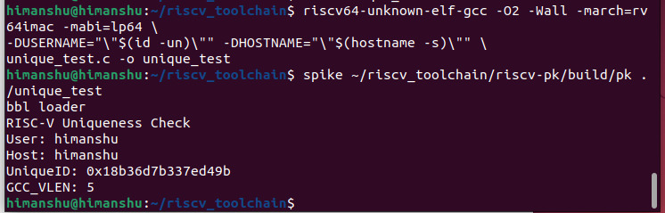
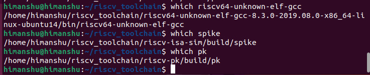
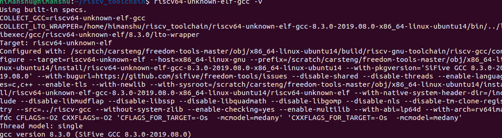
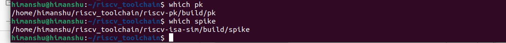

# RISC-V Toolchain setup and uniqueness test

By reading this you will be able to setup RISC V Toolchain in Ubuntu 22.04

## Table of contents

 - Prerequisites
 - ToolChain setup 
 - sanity checks
 - uniqueness test

## Prerequisites
 - A 64-bit Ubuntu 22.04     LTS environment.

 - For Windows users: Use Oracle VirtualBox with Ubuntu 22.04 LTS (2 vCPUs, 4-8 GB RAM, 30 GB disk).

 - Run the following command once to update your package lists before starting the tasks:
 ```bash
sudo apt-get update
```
## Step 1
__Install base developer tool__

These tools are essential build prerequisites for compilers, linkers, autotools, and libraries required by the RISC-V simulator, proxy kernel, and other tooling. GTKWave is included for waveform viewing.

```bash
sudo apt-get install -y git vim autoconf automake autotools-dev curl \
libmpc-dev libmpfr-dev libgmp-dev gawk build-essential bison flex \
texinfo gperf libtool patchutils bc zlib1g-dev libexpat1-dev gtkwave
```
## Step 2
__Creating a workspace__

Deficated library for RISC-V
```bash
cd
pwd=$PWD
mkdir -p riscv_toolchain
cd riscv_toolchain
```
## Step 3
__RISC-V GCC ToolChain__
```bash
wget "https://static.dev.sifive.com/dev-tools/riscv64-unknown-elf-gcc-8.3.0-2019.08.0-x86_64-linux-ubuntu14.tar.gz"
tar -xvzf riscv64-unknown-elf-gcc-8.3.0-2019.08.0-x86_64-linux-ubuntu14.tar.gz
```
## Step 4
__Add ToolChain to path__

We can use riscv64-unknown-elf-gcc and related binaries without typing their full paths, both immediately and in future terminal sessions.

```bash
echo 'export PATH="$HOME/riscv_toolchain/riscv64-unknown-elf-gcc-8.3.0-2019.08.0-x86_64-linux-ubuntu14/bin:$PATH"' >> ~/.bashrc
source ~/.bashrc
```
## Step 5
__Installing device tree compiler__

DTC is a common dependency in SoC/simulator flows and is expected by some RISC-V components.

```bash
sudo apt-get install -y device-tree-compiler
```
## Step 6

Spike is the reference RISC-V ISA simulator, used to validate the correctness of your compiled RISC-V ELF programs.

__Build and Install Spike__
```bash
cd $(pwd)/riscv_toolchain
git clone https://github.com/riscv/riscv-isa-sim.git
cd riscv-isa-sim
mkdir -p build && cd build
../configure --prefix=$(pwd)/riscv_toolchain/riscv64-unknown-elf-gcc-8.3.0-2019.08.0-x86_64-linux-ubuntu14
make -j$(nproc)
sudo make install
```
## Step 7

The proxy kernel (pk) provides a minimal runtime environment, allowing you to execute newlib ELF binaries under Spike using spike pk ./your_prog. It bridges your compiled program to the simulator.

__Build and Install RISC-V Proxy Kernel__
```bash
git clone https://github.com/riscv/riscv-pk.git
cd riscv-pk
git checkout v1.0.0 
mkdir -p build && cd build
../configure --prefix=$pwd/riscv_toolchain/riscv64-unknown-elf-gcc-8.3.0-2019.08.0-x86_64-linux-ubuntu14 --host=riscv64-unknown-elf
make -j$(nproc)
sudo make install
cd $pwd/riscv_toolchain
```
## Step 8
__ Ensure Cross Bin Directory is in path__

pk and other related utilities, which might be installed in a nested riscv64-unknown-elf/bin directory, are correctly found by your shell

```bash
echo 'export PATH="$HOME/riscv_toolchain/riscv64-unknown-elf-gcc-8.3.0-2019.08.0-x86_64-linux-ubuntu14/bin:$PATH"' >> ~/.bashrc
echo 'export PATH="$HOME/riscv_toolchain/riscv-isa-sim/build:$PATH"' >> ~/.bashrc
echo 'export PATH="$HOME/riscv_toolchain/riscv-pk/build:$PATH"' >> ~/.bashrc
source ~/.bashrc
```
## Step 9
__Install Icarus Verilog__
```bash
cd $pwd/riscv_toolchain
git clone https://github.com/steveicarus/iverilog.git
cd iverilog
git checkout --track -b v10-branch origin/v10-branch
git pull
chmod +x autoconf.sh
./autoconf.sh
./configure
```
## Quick sanity checks
Confirms the toolchain and simulator are visible and runnable from your terminal.
```bash
which riscv64-unknown-elf-gcc
riscv64-unknown-elf-gcc -v
which spike
spike --version || spike -h
which pk
```
## Step 10
__Uniqueness Test__
```bash
nano unique_test.c

#include <stdint.h>
#include <stdio.h>
#ifndef USERNAME
#define USERNAME "unknown_user"
#endif
#ifndef HOSTNAME
#define HOSTNAME "unknown_host"
#endif
// 64-bit FNV-1a
static uint64_t fnv1a64(const char *s) {
const uint64_t FNV_OFFSET = 1469598103934665603ULL;
const uint64_t FNV_PRIME = 1099511628211ULL;
uint64_t h = FNV_OFFSET;
for (const unsigned char *p = (const unsigned char*)s; *p; ++p) {
h ^= (uint64_t)(*p);
h *= FNV_PRIME;
}
return h;
}
int main(void) {
const char *user = USERNAME;
const char *host = HOSTNAME;
char buf[256];
int n = snprintf(buf, sizeof(buf), "%s@%s", user, host);
if (n <= 0) return 1;
uint64_t uid = fnv1a64(buf);
printf("RISC-V Uniqueness Check\n");
printf("User: %s\n", user);
printf("Host: %s\n", host);
printf("UniqueID: 0x%016llx\n", (unsigned long long)uid);
#ifdef __VERSION__
unsigned long long vlen = (unsigned long long)sizeof(__VERSION__) -
1;
printf("GCC_VLEN: %llu\n", vlen);
#endif
return 0;
}
```
__compile__
```bash
riscv64-unknown-elf-gcc -O2 -Wall -march=rv64imac -mabi=lp64 \
-DUSERNAME="\"$(id -un)\"" -DHOSTNAME="\"$(hostname -s)\"" \
unique_test.c -o unique_test
```
__Run__
```bash
spike ~/riscv_toolchain/riscv-pk/build/pk ./unique_test
```
__Unique Test output__

__list of directory__

__sanity checks__




## Error might be encountered 
 - Mismatch between version of spike and risc v degrade the version of spike.
 - Above script has degraded version of spike
 - Dont run a command twice otherwise error in path will occure.
 - Path error after step 7 __solve__ it by running first command of step8 then run step 7.
 - Above scirpts might not work in macbook as it has aarch64 processor


